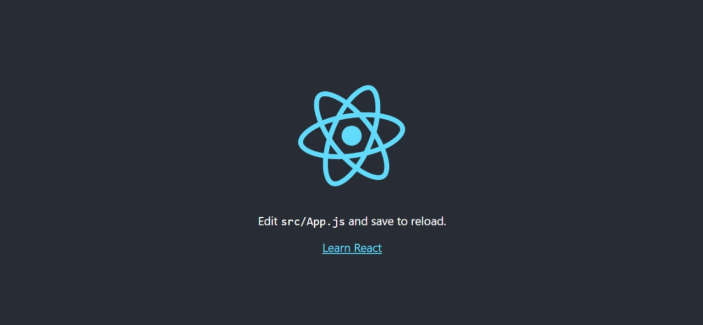

# **React JS**

## **Introduction**
React is a Frontend JavaScript library for building component-based user interfaces. It was built by Jordan Walke at Facebook It is used to build single-page applications. It is used to create reusable UI components.

## **Virtual DOM**
Virtual DOM has the most important role in ReactJS. While updating changes on the Web, React does not change the browser's DOM directly, instead it creates a virtual DOM in memory, where it does all the necessary manipulating, before making the changes in the browser’s DOM. Another functionality of React is that, it only changes the things, not the whole page, which makes our App fast and efficient.

## **Create React App**
Create React App is a comfortable environment for learning React, and is the best way to start building a new single-page application in React. It sets up your development environment so that you can use the latest JavaScript features. You’ll need to install NodeJS before started working using create-react-app. After installing, it’s time to create a project.
So type the following command in the terminal:

```
npx create-react-app my-first-app //my-first-app = your-app-name
```
It will take some time. After this type cd my-first-app, it will take you to your project folder.
Now type npm start, to start your project in the browser. You will see the following page in your browser.



If you move towards the project files, there will be a file named App.js in src folder. All your code will be in this file.


And if look into the code in App.js file, there is a function called App which is getting exported at the end of the code and rendering our App. Let’s change our Code and render Hello World in our browser using React.

```
function App() {
  return (
    <div className="App">
      <header className="App-header">Hello World</header>
    </div>
  );
}
```
Change your code same like above and check your browser, you will see Hello World rendered in browser.

## **Rendering Elements**
There is always a div with id root in the top level of our HTML document, which is place In our public directory. To render a React App, first we have to pass the DOM element to `ReactDOM.createRoot()`, then pass the React element to `root.render()`.

```
const root = ReactDOM.createRoot(document.getElementById('root'));
root.render(
  <React.StrictMode>
    <App />
  </React.StrictMode>
);
```
And all of this work is done in index.js file in src folder. You can see that on first line of code, we are creating our root by passing the root element from HTML document in the ReactDOM’s createRoot function. And after that we are passing our App element in the render function of created root. That App element used from the `App.js` file, which we have exported from App.js earlier.

## **JSX**
JSX stands for `JavaScript XML`. It allows us to write HTML in React. It makes it easier to write and add HTML in React. Otherwise, we have to use createElement and appendChild functions to create DOM elements. The same Hello world can be rendered by using JSX.

```
function App() {
  const hello = <span>Hello World</span>;
  return (
    <div className="App">
      <header className="App-header">{hello}</header>
    </div>
  );
}
```
As you can see, In above code, we are declaring a variable hello and assigning it a span tag. And after this, we have used that variable in the return statement and if you notice we have used that variable in curly braces, that’s how we use JSX, and it’s required to use curly braces.
You can also write expressions with JSX inside `curly braces { }`. The expression can be a React variable, or property, or any other valid JavaScript expression. JSX will execute the expression and return the result.

```
function App() {
  const variableJSX = <span>{5 + 5}</span>;
  return (
    <div className="App">
      <header className="App-header">{variableJSX}</header>
    </div>
  );
}
```
## **Components**
Components are used to split the UI into independent, reusable pieces.
Components are like functions that return HTML elements. There are two types of components:
- Class components
- Functional components

### **Class components**
Class components were the only way to track state and lifecycle on a React component. Function components were considered "state-less". With the addition of Hooks, Function components are now almost equivalent to Class components. The differences are so minor that you will probably never need to use a Class component in React. Even though Function components are preferred, there are no current plans on removing Class components from React. Because of this reason, we will only use Functional components in the upcoming topics.

### **Functional components**
The simplest way to define a functional component is to write a JavaScript function. A Function component also returns HTML, and behaves much the same way as a Class component because of the hooks, but Function components can be written using much less code.
Let’s move towards our app and create a function named Welcome and call it in your App function, as our App function is the top-level component of the entire App, as discussed earlier. One simple naming convention about components is that, they always start with capital letters. You can see the code below:

```
function App() {
  return (
    <div className="App">
      <header className="App-header">
        <Welcome />
      </header>
    </div>
  );
}

function Welcome() {
  return <h3>Hello user</h3>;
}
```
We call the components like the HTML elements, as you can see in the code. After this, run your app using npm start, you will see a h3 heading in the browser. As said earlier, components are reusable pieces of code, so if you call Welcome component three times, there will be three h3 headings in the browser.

### **Functional components in Files**
As our component size gets bigger, we have to manage them in separate files. Let’s move the above component in a separate file. So, create a new folder in src folder named Components and inside create a file named Welcome with a .js extension. Then move your Welcome function inside that file and at the end export that function. You can see the code below:


The next step is to import this function in our main App file, for this we use import statement in a very top-level in `App.js` file, (which you can see in the code below). Make sure you add correct path of Welcome component. And now if you run the app, you will see the same output as before.

```
//Code in App.js file

import "./App.css";
import Welcome from "./Components/Welcome";

function App() {
  return (
    <div className="App">
      <header className="App-header">
        <Welcome />
      </header>
    </div>
  );
}

export default App;
```
## **Props**
As we created a component which can render “Hello user” in the browser, what if we have to render the actual name of the user, which would be dynamic. So, there comes the concept of Props. Props are arguments passed into React components. Props stands for properties. The component receives the argument as a props object. Let’s change the code in Welcome component and make it work for dynamic data. Add a props parameter in the function brackets. As said above that the props is an object, so use this object and call our passed value “name” (which we will pass, when we call our Welcome component) using dot notation in the function body in place of “user” text.

```
function Welcome(props) {
  return <h3>Hello {props.name}</h3>;
}
```
The next step is to pass the value in the Welcome component, so move towards the App.js file and pass the user’s name.

```
function App() {
  return (
      ...
      <Welcome name="Ahmad" />
      ...
  );
}
```
After these changes, when we open the browser, we will see an h3 heading with text Hello Ahmad, which means our props are working correctly. We can pass any number of props in a component.

## **Event Handling**
Handling events with React elements is very similar to handling events on DOM elements. React events are named using camelCase, rather than lowercase. React has the same events as HTML: `click, change, mouseover` etc. Lets move towards an example and create a button in the App file and add an event handler function to that button.

```
function App() {
  const alertUser = () => {
    alert("Alert using event handler in React");
  };
  return (
    <div className="App">
      <header className="App-header">
        <Welcome name="Ahmad" />
        <button onClick={alertUser}>Click Me</button>
      </header>
    </div>
  );
}
```
You can see in the above code that we create an arrow function called alertUser and inside the body we called an alert box with some text and after all we attached this function to the onClick event of the button. After running your app, if you click on the button, you will see an alert box.

### **Passing arguments in Event handlers**
In this case, we just have to introduce the parameters in the event handler and call that function using an arrow function.

```
function App() {
  const alertUser = (user) => {
    alert(`Hello ${user}`);
  };
  return (
        ...
        <button onClick={() => alertUser("Afzal")}>Click Me</button>
        ...
  );
}
```
You can see we called the alertUser function using an arrow function and passed the value in the parameters.

## **Conditional Rendering**
### **If statement**
In React, you can conditionally render components. Conditional rendering in React works the same way conditions work in JavaScript. Use JavaScript operators like if or the conditional operators to conditionally render the components. Let’s take an example and demonstrate this. Add the following functional compo in your App function.

```
 function UserGreeting() {
    return <h1>Welcome back!</h1>;
  }

 function GuestGreeting() {
    return <h1>Please sign up.</h1>;
  }

 function Greeting(props) {
    const isLoggedIn = props.isLoggedIn;
    if (isLoggedIn) {
      return <UserGreeting />;
    }
    return <GuestGreeting />;
  }
```
In the last functional component, we are getting the assed prop and storing in a variable, called isLoggedIn and using that in if statement that either is the passed value is true and false and on the basis of this, we are rendering the other two functional components. And at the end we are calling this last component in our App component, just like below:

```
function App() {
  return (
       ...
      <header className="App-header">
        <Greeting isLoggedIn={false} />
      </header>
       ...
  );
}
```
If you run the app you will see “Please sign up.” In the browser and if you change the argument value to true in the App function, you will see “Welcome back in the browser.

### **&& Operator**
You may embed expressions in JSX by wrapping them in curly braces. This includes the JavaScript logical && operator. It can be handy for conditionally including an element. Here is an example of && operator.

```
function Inbox(props) {
  const unreadMessages = props.unreadMessages;
  return (
    <div>
      <h1>Hello user!</h1>
      {unreadMessages.length > 0 && (
        <h2>You have {unreadMessages.length} unread messages.</h2>
      )}
    </div>
  );
}
```
In the above code, the unreadMessages is an array of messages which is passed through props and in the return statement we are checking that either the array is empty or not and after that we are using && operator and using an h2 heading. It works because in JavaScript, true && expression always evaluates to expression, and false && expression always evaluates to false. Therefore, if the condition is true, the element right after && will appear in the output. If it is false, React will ignore and skip it.

And in the App component we are calling this component and passing an array of messages.

```
function App() {
  const messages = ["Message01", "Message02", "Message03"];
  return (
    <div className="App">
      <header className="App-header">
        <Inbox unreadMessages={messages} />
      </header>
    </div>
  );
}
```
And if you pass an empty array, you will not get any messages related text in the browser.

### **Ternary Operator**
Another method for conditionally rendering elements inline is to use the JavaScript conditional operator. It is a short version of if else statement. We can use the if statement example using ternary operator.

```
condition ? true : false
```
```
function Greeting(props) {
  const isLoggedIn = props.isLoggedIn;
  return isLoggedIn ? <UserGreeting /> : <GuestGreeting />;
}
```
The above code works the same but its cleaner and short code than before.

## **Lists**
In React, you will render lists with some type of loop. The JavaScript map() array method is generally the preferred method. In the code below, we used the map() function to take an array of numbers and double their values. We assign the new array returned by map() to the variable doubled and logged it.

```
const numbers = [1, 2, 3, 4, 5];
const doubled = numbers.map((number) => number * 2);
console.log(doubled);
```
This code logs [2, 4, 6, 8, 10] to the console. In React, transforming arrays into lists of elements is nearly identical.

To learn the concept of lists, we have an example, paste the following function in the App.js file.

```
function Cities() {
  const cities = ["Lahore", "Karachi", "Faislabad", "Islamabad"];
  return (
    <>
      <h3>What are the different cities of Pakistan?</h3>
      <ul>
        {cities.map((city) => (
          <li style={{ textAlign: "left" }}>{city}</li>
        ))}
      </ul>
    </>
  );
}
```
In this code, we have an array and we are mapping to that array and returning an li tag element which is getting enclosed in a ul tag. Your output will look like below:


### **Keys**
If you look in the console of your browser, you will see an error about keys, which is preferred practice for list children. The error would look like below:


Keys allow React to keep track of elements. Keys help React identify which items have changed, are added, or are removed. Keys should be given to the elements inside the array to give the elements a stable identity. Keys need to be unique to each sibling. But they can be duplicated globally. For this reason we have introduce keys in our children which are li tags. Change following things in your code.

```
function Cities() {
  const cities = [
    { id: 1, name: "Karachi" },
    { id: 2, name: "Lahore" },
    { id: 3, name: "Faisalabad" },
    { id: 4, name: "Islamabad" },
  ];
  return (
    <>
      <h3>What are the different cities of Pakistan?</h3>
      <ul>
        {cities.map((city) => (
          <li key={city.id} style={{ textAlign: "left" }}>
            {city.name}
          </li>
        ))}
      </ul>
    </>
  );
}
```
Now we are using the best practices of keys and you will see no error in the console window of the browser.

## **React Forms**

React uses forms to allow users to interact with the web page like in HTML. HTML form elements work a bit differently from other DOM elements in React, because form elements naturally keep some internal state. For example, this simple form works fine as it do in HTML. But we don’t want our form to be controlled by HTML but we want the form to be controlled by React components. This method is a standard in React and is called “Controlled Components”.

```
function Form() {
  return (
    <form>
      <label>
        Name:
        <input style={{ marginLeft: "10px" }} type="text" />
      </label>
    </form>
  );
}
```

### **Form handling**
In HTML, form elements typically maintain their own state and update it based on user input. We want to work like which component renders the form, that component has to maintain the form. Which means we will have only “one source of truth”. When the data is handled by the components, all the data is stored in the component state. Here comes the concept of Hooks, which is the main thing in functional components. We will learn about hooks later on. The forms are handled by a hook called “useState”, which is used to maintain the state in functional components.

```
function Form() {
  const [name, setName] = useState("");

  return (
    <form>
      <label>
        Name:
        <input
          style={{ marginLeft: "10px" }}
          type="text"
          value={name}
          onChange={(e) => setName(e.target.value)}
        />
      </label>
    </form>
  );
}
```
In useState, there are two things, which have to use, one is the state variable and the other one is state updating function, as you can see in the first highlighted line of code above. It is a convention to name this function starting with “use”. As we can add event handlers to our form components. To maintain our state, we will use onChange event handler on form elements, as you can see second highlighted line in the above code. That’s how we can manage element states in React forms. We will discuss further form elements.

### **Submitting Forms**
We can submit forms by using onSubmit event handler in the form element. We have to assign our form handling function to the onSubmit form handler as you can see below.

```
function Form() {
  const [name, setName] = useState("");
  const handleSubmit = (e) => {
    e.preventDefault();
    alert(`Hello ${name}`);
  };

  return (
    <form onSubmit={handleSubmit}>
      <label>
        Name:
        <input
          style={{ marginLeft: "10px" }}
          type="text"
          value={name}
          onChange={(e) => setName(e.target.value)}
        />
      </label>
    </form>
  );
}
```
The above code will alert the user with the entered name in the form of an alert box. The preventDefault in the handleSubmit function will prevent from the default behaviours of a from, like submitting the form etc.

### **Multiple Inputs in Form**
In this case, we don’t have to use different states for different input fields, instead we can use Javascript object in useState, which can hold multiple values, hence managing multiple states. We can control the values of more than one input field by adding a name attribute to each element.

```
function Form() {
  const [multipleInputs, setmultipleInputs] = useState({});
  const handleChange = (event) => {
    const name = event.target.name;
    const value = event.target.value;
    //brackets notation
    setmultipleInputs((values) => ({ ...values, [name]: value })); 
  };

  const handleSubmit = (event) => {
    event.preventDefault();
    alert(multipleInputs);
  };

  return (
    <form onSubmit={handleSubmit}>
      <label>
        Name:
        <input
          type="text"
          name="username"
          value={multipleInputs.username} //dot notation
          onChange={handleChange}
        />
      </label>
      <label>
        Age:
        <input
          type="number"
          name="age"
          value={multipleInputs.age || ""} //dot notation
          onChange={handleChange}
        />
      </label>
      <input type="submit" />
    </form>
  );
}
```

As you can see in the above code, we have a Javascript object in useState and we are using that object state to use different state values, we will use dot notations you can see in the return statement of the function. While to update the state, use [bracket notation] around the property name. While updating one input state, we are also persisting other states by using spread operator. We use the same event handler function for both input fields, we could write one event handler for each, but this gives us much cleaner code and is the preferred way in React.

## **React Routing**

While creating React App using create-react-app, we don’t get any functionality for routing different pages. To solve this problem, we have to install a package called `React Router DOM`. So head over your terminal and type the following command.

```
npm i -D react-router-dom@latest
```
There is a folder structure that’s specified for routing. You have create a folder the src folder, and name it Pages, and inside that folder, create multiple files and filed them with code as below:


The next step is to route the pages using React Router DOM. Head towards our Top Level, which is the App function in App.js file.
First import all the pages in our App.js file

```
import Home from "./Pages/Home";
import Blog from "./Pages/Blog";
import Contacts from "./Pages/Contacts";
import NoPage from "./Pages/NoPage";
```
And now import the necessary things from React Router DOM, which are Browser Router, Routes and Route.

```
import { BrowserRouter, Routes, Route } from "react-router-dom";
```
Now its time to specify routes in the return statement of our App. Make your App function look like below:

```
function App() {
  return (
    <div className="App">
      <header className="App-header">
        <BrowserRouter>
          <Routes>
            <Route index element={<Home />} />
            <Route path="blogs" element={<Blog />} />
            <Route path="contacts" element={<Contacts />} />
            <Route path="*" element={<NoPage />} />
          </Routes>
        </BrowserRouter>
      </header>
    </div>
  );
}
```
We wrap our content first with `<BrowserRouter>`. Then we define our `<Routes>` .Inside `<Routes>`, we can have many `<Route>`, so we added our main routes which are for Home, Blog, Contacts and 404 Page. Inside the `<Route>` componenet we have added a path property and assigned them our specific paths, which are basically URLs to be used in browser. If we set the path to * , that will be used for all paths, that are not specified. This route is good for detecting gibberish page URLs, that are not specified, so we always add a 404 Page to this URL, as we did in above code.

---
## **What to do next?**
From this introduction, you can move forward towards advanced React concepts like Hooks, State Management, Context etc.